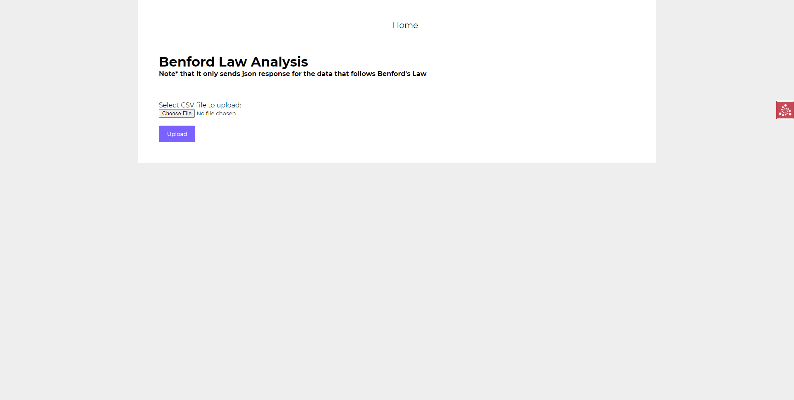
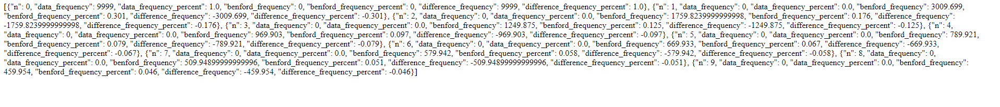
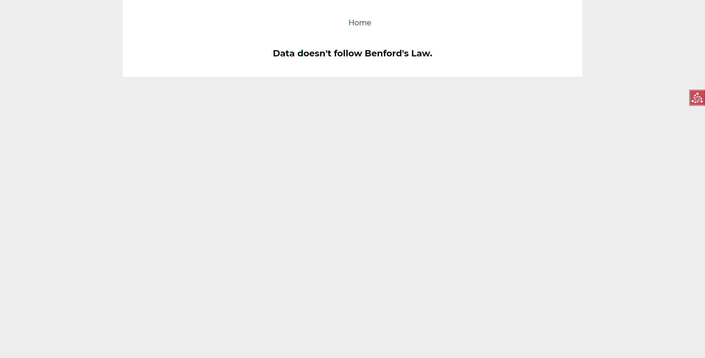

# Benford-Law-Analysis
This project was created as a part of Challenge Project for Genese Hiring Process. The application is developed using Python/Pyramid. 

To generate CSV data for testing, run:
> py datagenerator.py

It generates three different CSVs in "uploads/":
1. wholeNum.csv which doesn't follow Benford's Law
2. benfordData.csv which doesn't follow Benford's Law
3. completeRandom.csv which can be tested if it satisfies Benford's Law.

Using this application:
1. User can upload a csv with 10k rows and 1 column to check if satisfies Benford's Law .
    1. If a data in rows follow Benford's Law, json response can be received.
    2. Else, a message is displayed "Data doesn't follow Benford's Law."

To run the application, make sure you have all dependencies installed:
> pip install -r requirements.txt

Once all packages has been installed, run:
> py main.py

Screenshot of the UI:

